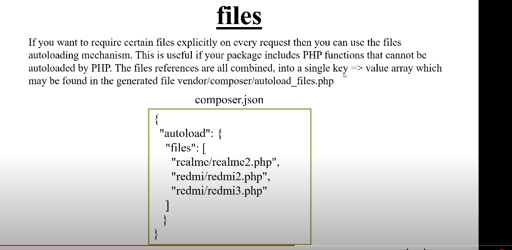
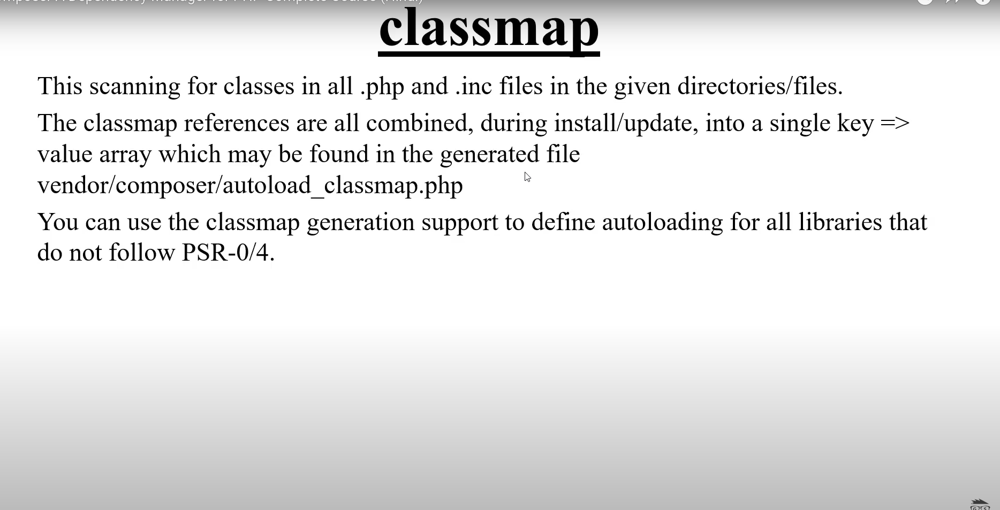
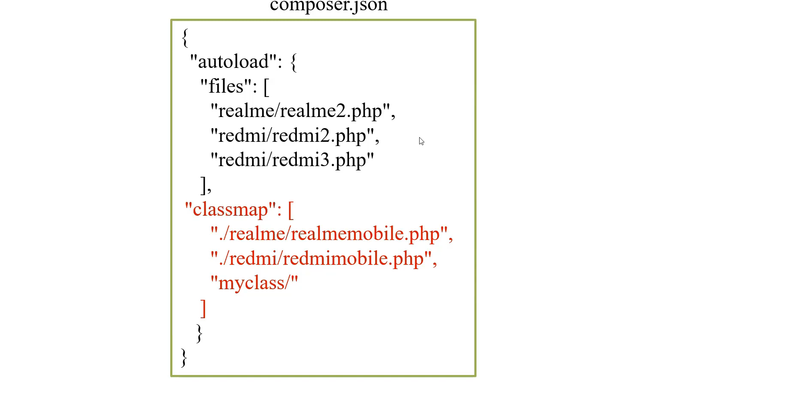
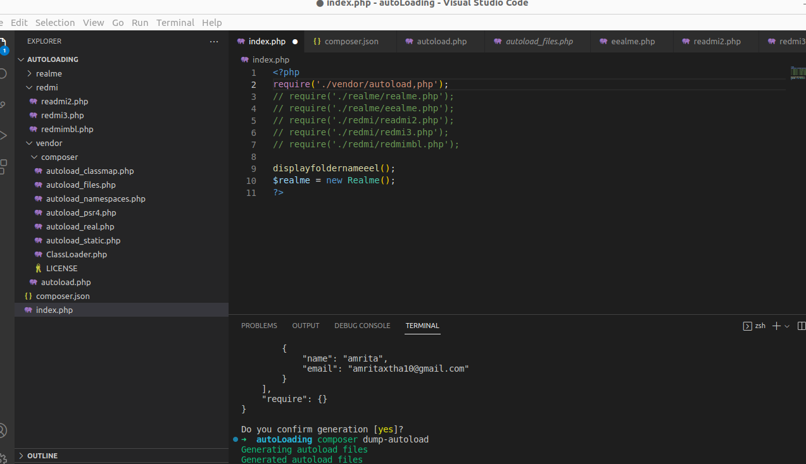
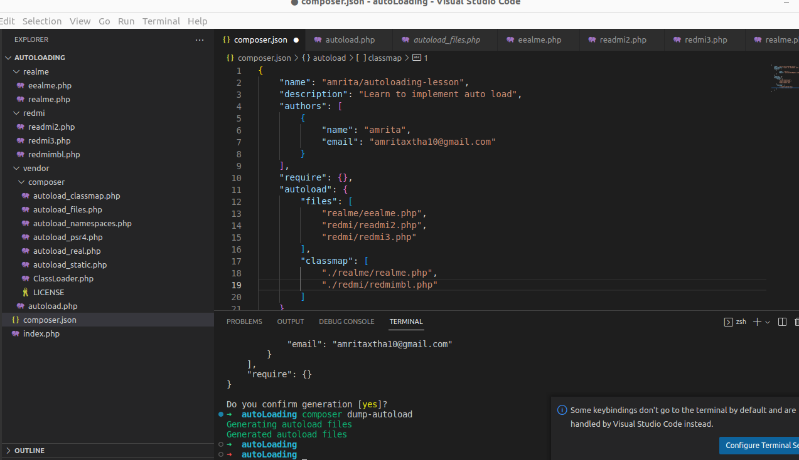
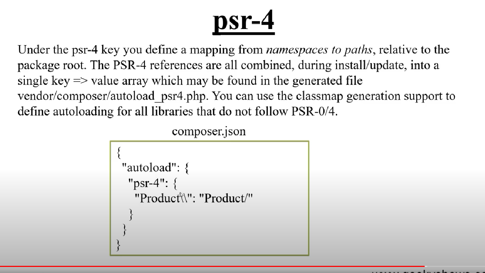

- autoload
- autoload-dev
	- files
	- classmap
	- psr-4
	
	# dump-autoload/dumpautoload(command)
to update autoloader
- composer dump-autoloader









# Files

1. create folder redmi and realme
2. Create files inside bothfolder
3. define function in one file of each folder
```
<?php
function displayfoldernameredmi2(){
    echo "Readmi2 function <br>";
}
?>
```
4. define class in one file of each folder
```
<?php
class Redmimbl{
    function __construct(){
        echo "REDMI MOBILE CLASS <br>";
    }
}

?>
```
5. call both file folder from root index.php file
```
<?php
require('./realme/realme.php');
require('./realme/eealme.php');
require('./redmi/readmi2.php');
require('./redmi/redmi3.php');
require('./redmi/redmimbl.php');

displayfoldernameeel();
$realme = new Realme();
?>
```



6. Using autoloader
	1. composer init
	2. add autoload keyword in composer.json file
```
	{
    "name": "amrita/autoloading-lesson",
    "description": "Learn to implement auto load",
    "authors": [
        {
            "name": "amrita",
            "email": "amritaxtha10@gmail.com"
        }
    ],
    "require": {},
    "autoload": {
        "files": [
            "realme/eealme.php",
            "redmi/readmi2.php",
            "redmi/redmi3.php"
        ]
    }
}
```
	
	3.in index.php
```
	<?php
	require('./vendor/autoload,php');

	displayfoldernameeel();
	$realme = new Realme();
	?>
```


4. `composer dump-autoload ` 
this command create compose folder where we can see differnet autload file




# Class
# Exclude from
```
"autoload": {
        "files": [
            "realme/eealme.php",
            "redmi/readmi2.php",
            "redmi/redmi3.php"
        ],
        "classmap": [
            "./realme/realme.php",
            "./redmi/redmimbl.php"
						 "./redmi"
        ],
        "exclude-from-classmap": [
            "./realme/realme.php"
        ]
    }
```

# psr-4




