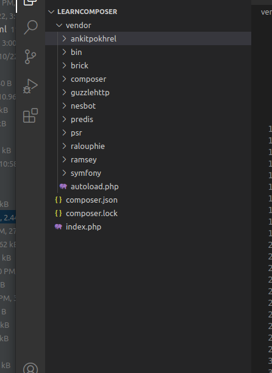

# Format
`composer require VendorName/PackageName`


# Syntax
|Syntax|Example|
|-----|---
|composer require VendorName/PackageName| composer require amrita/tus|
|composer require VendorName/PackageName:tag| composer require amrita/tus:dev-master|
|composer require VendorName/PackageName:version| composer require amrita/tus:1.9.0|

# Add package to require-dev key
`composer require VendorName/PackageName --dev`

# Site to find php package
[Visit php package finding website](https://packagist.org/)

# Demo
`>>  learnComposer composer require ankitpokhrel/tus-php`
`>>  learnComposer composer require ankitpokhrel/tus-php:2.2.0`
composer auto install all the needed package/library require for our install lib (tus-php package)

```

Info from https://repo.packagist.org: #StandWithUkraine
Using version ^2.3 for ankitpokhrel/tus-php
./composer.json has been updated
Running composer update ankitpokhrel/tus-php
Loading composer repositories with package information
Updating dependencies
Lock file operations: 34 installs, 0 updates, 0 removals
  - Locking ankitpokhrel/tus-php (v2.3.0)
  - Locking brick/math (0.9.3)
  - Locking guzzlehttp/guzzle (7.5.0)
  - Locking guzzlehttp/promises (1.5.2)
  - Locking guzzlehttp/psr7 (2.4.3)
  - Locking nesbot/carbon (2.64.0)
  - Locking predis/predis (v2.0.3)
  - Locking psr/container (1.1.2)
  - Locking psr/event-dispatcher (1.0.0)
  - Locking psr/http-client (1.0.1)
  - Locking psr/http-factory (1.0.1)
  - Locking psr/http-message (1.0.1)
  - Locking ralouphie/getallheaders (3.0.3)
  - Locking ramsey/collection (1.2.2)
  - Locking ramsey/uuid (4.2.3)
  - Locking symfony/console (v5.4.16)
  - Locking symfony/deprecation-contracts (v2.5.2)
  - Locking symfony/event-dispatcher (v5.4.9)
  - Locking symfony/event-dispatcher-contracts (v2.5.2)
  - Locking symfony/http-foundation (v5.4.16)
  - Locking symfony/mime (v5.4.16)
  - Locking symfony/polyfill-ctype (v1.27.0)
  - Locking symfony/polyfill-intl-grapheme (v1.27.0)
  - Locking symfony/polyfill-intl-idn (v1.27.0)
  - Locking symfony/polyfill-intl-normalizer (v1.27.0)
  - Locking symfony/polyfill-mbstring (v1.27.0)
  - Locking symfony/polyfill-php72 (v1.27.0)
  - Locking symfony/polyfill-php73 (v1.27.0)
  - Locking symfony/polyfill-php80 (v1.27.0)
  - Locking symfony/polyfill-php81 (v1.27.0)
  - Locking symfony/service-contracts (v2.5.2)
  - Locking symfony/string (v5.4.15)
  - Locking symfony/translation (v5.4.14)
  - Locking symfony/translation-contracts (v2.5.2)
Writing lock file
Installing dependencies from lock file (including require-dev)
Package operations: 34 installs, 0 updates, 0 removals
  - Downloading symfony/mime (v5.4.16)
  - Downloading symfony/http-foundation (v5.4.16)
  - Downloading psr/event-dispatcher (1.0.0)
  - Downloading symfony/event-dispatcher-contracts (v2.5.2)
  - Downloading symfony/event-dispatcher (v5.4.9)
  - Downloading symfony/polyfill-intl-grapheme (v1.27.0)
  - Downloading symfony/polyfill-ctype (v1.27.0)
  - Downloading symfony/string (v5.4.15)
  - Downloading symfony/console (v5.4.16)
  - Downloading symfony/polyfill-php81 (v1.27.0)
  - Downloading ramsey/collection (1.2.2)
  - Downloading brick/math (0.9.3)
  - Downloading ramsey/uuid (4.2.3)
  - Downloading predis/predis (v2.0.3)
  - Downloading symfony/translation (v5.4.14)
  - Downloading nesbot/carbon (2.64.0)
  - Downloading ankitpokhrel/tus-php (v2.3.0)
  - Installing symfony/polyfill-php80 (v1.27.0): Extracting archive
  - Installing symfony/polyfill-mbstring (v1.27.0): Extracting archive
  - Installing symfony/polyfill-php72 (v1.27.0): Extracting archive
  - Installing symfony/polyfill-intl-normalizer (v1.27.0): Extracting archive
  - Installing symfony/polyfill-intl-idn (v1.27.0): Extracting archive
  - Installing symfony/deprecation-contracts (v2.5.2): Extracting archive
  - Installing symfony/mime (v5.4.16): Extracting archive
  - Installing symfony/http-foundation (v5.4.16): Extracting archive
  - Installing psr/event-dispatcher (1.0.0): Extracting archive
  - Installing symfony/event-dispatcher-contracts (v2.5.2): Extracting archive
  - Installing symfony/event-dispatcher (v5.4.9): Extracting archive
  - Installing symfony/polyfill-intl-grapheme (v1.27.0): Extracting archive
  - Installing symfony/polyfill-ctype (v1.27.0): Extracting archive
  - Installing symfony/string (v5.4.15): Extracting archive
  - Installing psr/container (1.1.2): Extracting archive
  - Installing symfony/service-contracts (v2.5.2): Extracting archive
  - Installing symfony/polyfill-php73 (v1.27.0): Extracting archive
  - Installing symfony/console (v5.4.16): Extracting archive
  - Installing symfony/polyfill-php81 (v1.27.0): Extracting archive
  - Installing ramsey/collection (1.2.2): Extracting archive
  - Installing brick/math (0.9.3): Extracting archive
  - Installing ramsey/uuid (4.2.3): Extracting archive
  - Installing predis/predis (v2.0.3): Extracting archive
  - Installing symfony/translation-contracts (v2.5.2): Extracting archive
  - Installing symfony/translation (v5.4.14): Extracting archive
  - Installing nesbot/carbon (2.64.0): Extracting archive
  - Installing psr/http-message (1.0.1): Extracting archive
  - Installing psr/http-client (1.0.1): Extracting archive
  - Installing ralouphie/getallheaders (3.0.3): Extracting archive
  - Installing psr/http-factory (1.0.1): Extracting archive
  - Installing guzzlehttp/psr7 (2.4.3): Extracting archive
  - Installing guzzlehttp/promises (1.5.2): Extracting archive
  - Installing guzzlehttp/guzzle (7.5.0): Extracting archive
  - Installing ankitpokhrel/tus-php (v2.3.0): Extracting archive
15 package suggestions were added by new dependencies, use `composer suggest` to see details.
Generating autoload files
28 packages you are using are looking for funding.
Use the `composer fund` command to find out more!


```

- composer.lock and vendor files will be created automatically when we install package 





